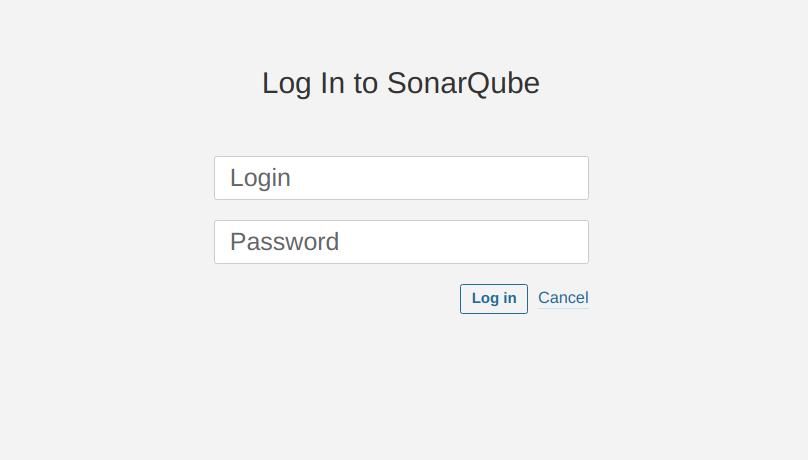
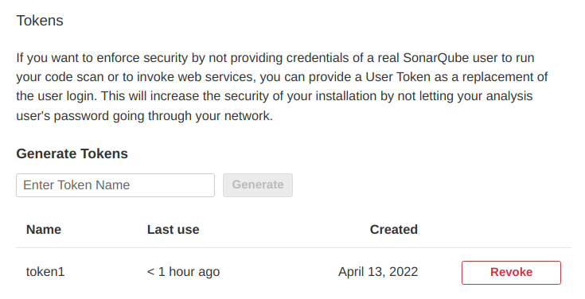
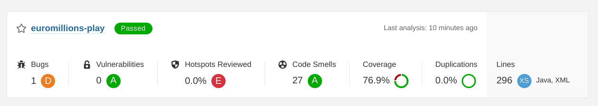

# Lab6 - Static Code analysis (with Sonar Qube)
### Pedro Monteiro 97484
<br>

### **Sonar Qube** Installation
```
docker run -d --name sonarqube -e SONAR_ES_BOOTSTRAP_CHECKS_DISABLE=true -p 9000:9000 sonarqube:latest
```

Interface is available at http://127.0.0.1:9000/


By default the credentials are:
- login: admin
- password: admin

As asked, the credentials were changed.

Later a token was created to be used in code analysis, being able to loggin into the Sonar Qube container.


Run code and analyzing with **Sonar Qube**:
```
mvn clean verify sonar:sonar \
  -Dsonar.projectKey=tqs_lab6_2 \
  -Dsonar.host.url=http://127.0.0.1:9000 \
  -Dsonar.login=ae065b0656e8c70b2666ea9c514a25b541d6a41b
```


### Problems
| Issue | Problem Description | How to Solve |
| :--- | :--- | :--- |
| Save and re-use this "Random" | Creating a new Random object each time a random value is needed is inefficient and may produce numbers which are not random depending on the JDK. The Random() constructor tries to set the seed with a distinct value every time. However there is no guarantee that the seed will be random or even uniformly distributed. Some JDK will use the current time as seed, which makes the generated numbers not random at all. This rule finds cases where a new Random is created each time a method is invoked.| For better efficiency and randomness, create a single Random, then store, and reuse it. |
| Code Smell: Refactor the code in order to not assign to this loop counter from within the loop body | A for loop stop condition should test the loop counter against an invariant value (i.e. one that is true at both the beginning and ending of every loop iteration). | The stop condition should be set to a local variable just before the loop begins. |
| Reorder the modifiers to comply with the Java Language Specification | The Java Language Specification recommends listing modifiers in the following order: annotations, public, protected, private, abstract, static, final, transient, volatile, synchronized, native, default, strictfp. Not following this convention has no technical impact, but will reduce the code’s readability because most developers are used to the standard order. | To solve just need to follow this convention. |
| Replace this use of System.out or System.err by a logger. | When logging a message there are several important requirements which must be fulfilled: the user must be able to easily retrieve the logs, the format of all logged message must be uniform to allow the user to easily read the log, logged data must actually be recorded, sensitive data must only be logged securely. If a program directly writes to the standard outputs, there is absolutely no way to comply with those requirements. | Defining and using a dedicated logger is highly recommended. |
