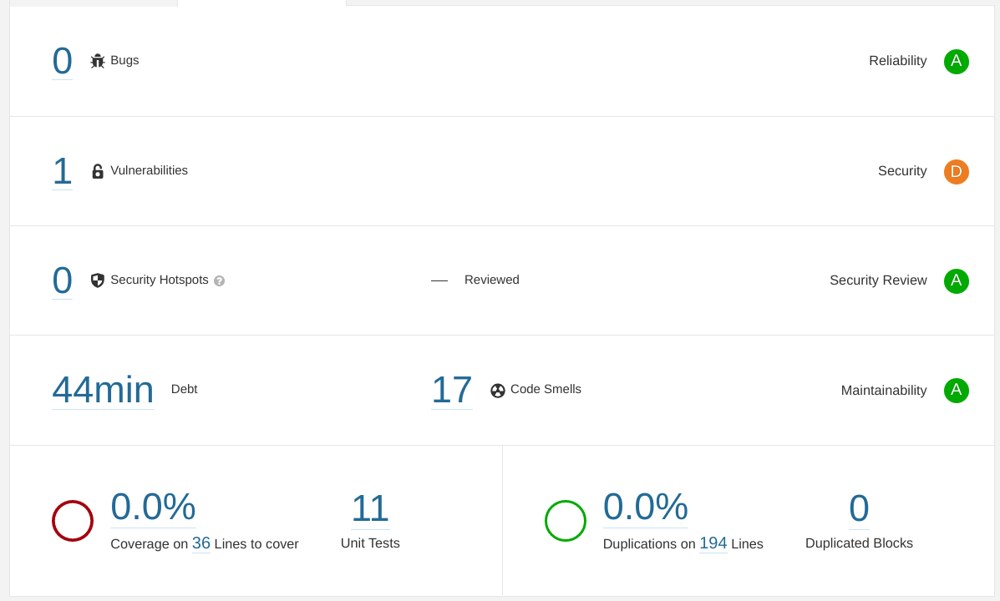
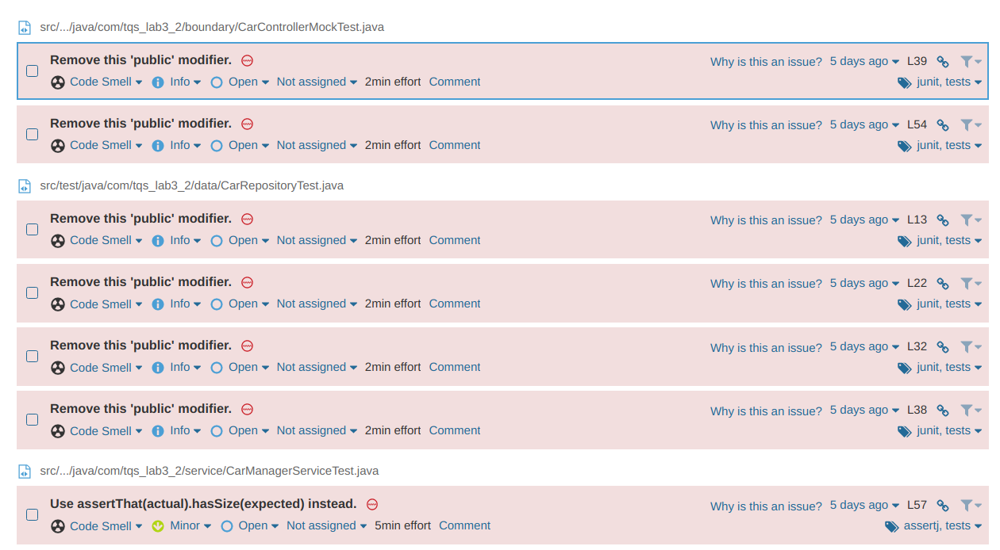
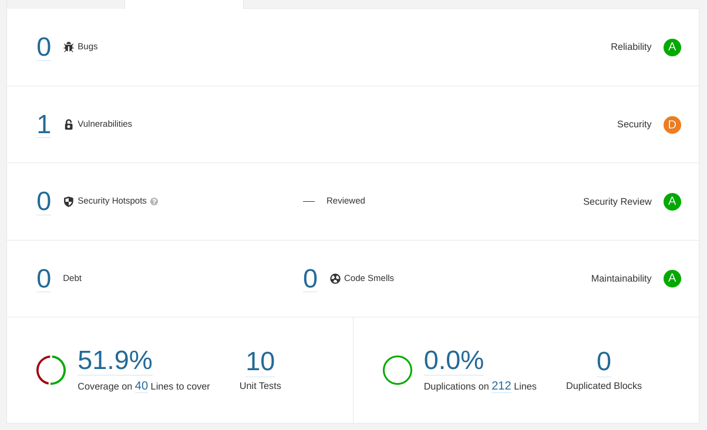
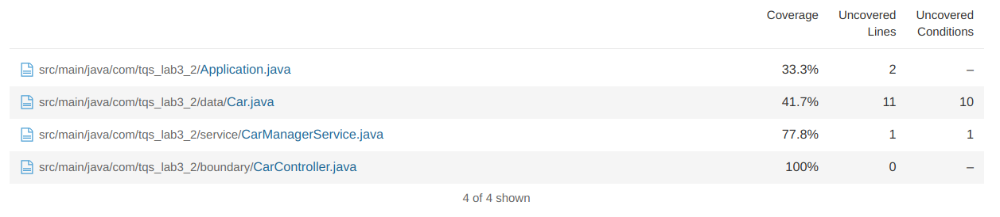

# Lab6 - Static Code analysis (with Sonar Qube)
### Pedro Monteiro 97484
 

### Questions
#### a) Take note of the technical debt found. Explain what this value means.
Technical debt corresponds to the time required to solve the problems that are identified using SonarQube. In my case it was of 44 minutes.

#### b) Analyze the reported problems and be sure to correct the severecode smells reported (critical and major).
Code smells reported:
- Remove this unused import 'org.springframework.web.bind.annotation.RequestParam'.
- Replace the type specification in this constructor call with the diamond operator ("<>").
- Add at least one assertion to this test case.
- Remove this 'public' modifier.
- Use assertThat(actual).hasSize(expected) instead.

Example of code smells reported:

After solving these code smells: 

#### d) Run the static analysis and observe/explore the coverage values on the SonarQube dashboard.How many lines are “not covered”? And how many conditions?
With Jacoco plugin it is possible to see how much code was tested.

14 uncovered lines and 11 uncovered conditions
